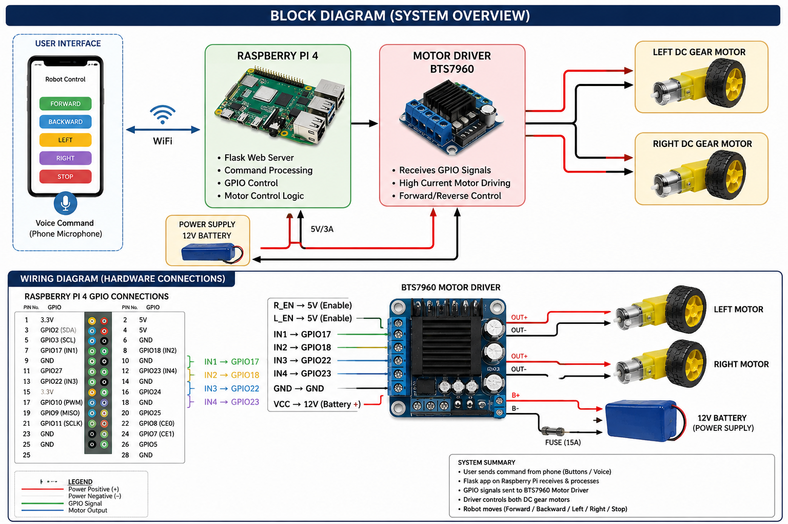

# Interactive Humanoid Robot



An embedded robotics project demonstrating WiFi-based humanoid robot control using Raspberry Pi, Flask, and browser-based voice interaction.

---

## Features

- WiFi-based remote robot control
- Browser-controlled movement interface
- Voice-controlled robot commands
- Differential drive robotic movement
- Raspberry Pi GPIO motor control
- Flask-based embedded web server

---

## Technologies Used

- Raspberry Pi 4
- Python
- Flask
- HTML/CSS/JavaScript
- RPi.GPIO
- Web Speech API
- BTS7960 Motor Driver

---

## Robot Capabilities

- Forward movement
- Backward movement
- Left/right turning
- Rotation
- Stop control
- Voice-command interaction

---

## Repository Structure

```text
interactive-humanoid-robot/
│
├── app.py
├── motor_control.py
├── requirements.txt
│
├── templates/
│   └── index.html
│
├── static/
│   ├── style.css
│   └── script.js
│
├── diagrams/
│   └── block_diagram.png
│
└── README.md
```

---

## Hardware Components

- Raspberry Pi 4
- BTS7960 Motor Driver
- 2x DC Geared Motors
- 12V Battery
- Humanoid Robot Chassis
- Wheels

---

## Flask Control Flow

```text
Phone Browser
      ↓
Flask Web Interface
      ↓
Raspberry Pi GPIO
      ↓
Motor Driver
      ↓
Robot Movement
```

---

## Voice Command Flow

```text
Phone Microphone
      ↓
Web Speech API
      ↓
JavaScript Command Detection
      ↓
Flask Backend
      ↓
GPIO Motor Control
```

---

## Installation

Clone repository:

```bash
git clone https://github.com/yourusername/interactive-humanoid-robot.git
```

Install dependencies:

```bash
pip install -r requirements.txt
```

Run Flask application:

```bash
python app.py
```

---

## Access Web Interface

Open browser on same WiFi network:

```text
http://RASPBERRY_PI_IP:5000
```

Example:

```text
http://192.168.1.5:5000
```

---

## Future Improvements

- Camera integration
- Live video streaming
- Servo-based head rotation
- Mobile application
- Object detection
- Autonomous navigation

---

## Project Focus

This project focuses on:

- Embedded Systems
- Robotics Control
- Human–Robot Interaction
- Wireless Robotics Communication
- Hardware–Software Integration